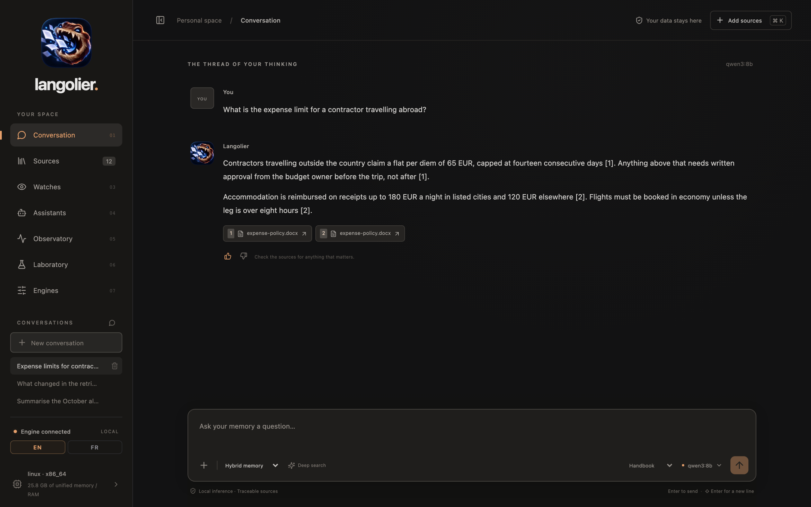
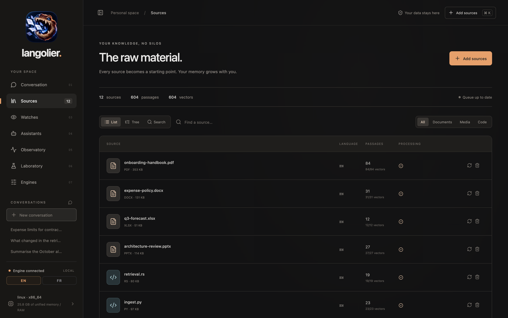
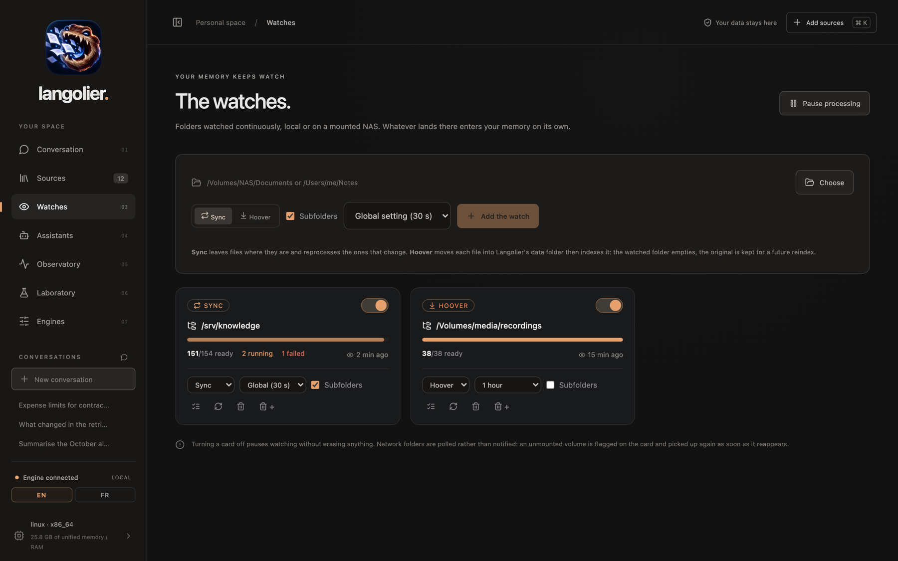
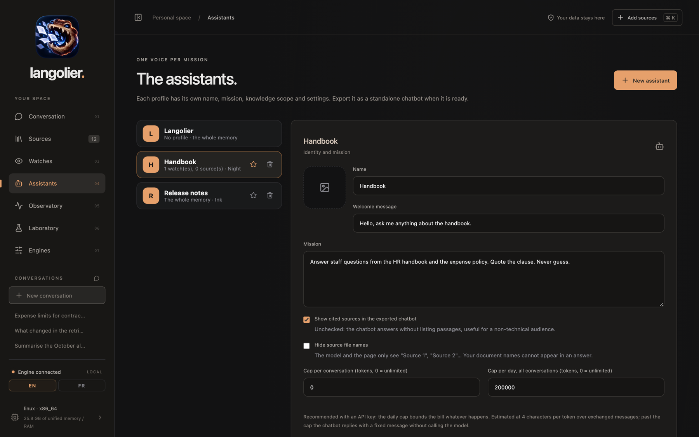
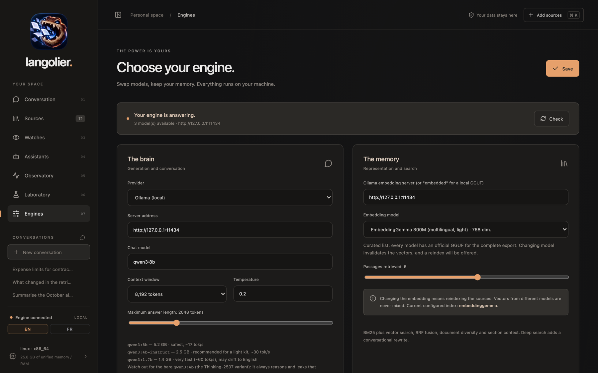
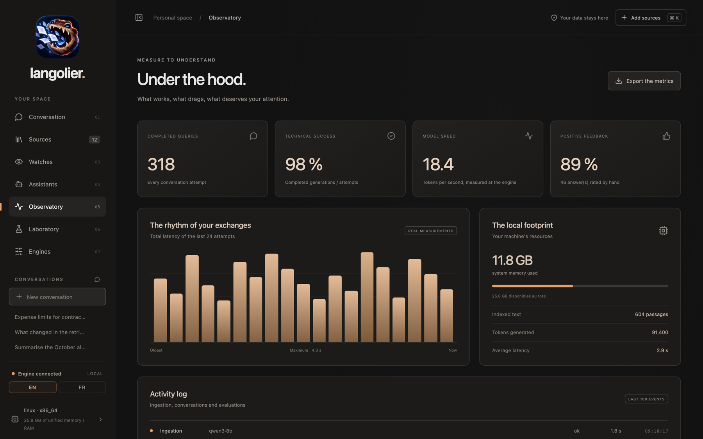

<div align="center">


# Langolier

**A local knowledge studio. Feed it documents, code, videos and voice notes, ask questions, get answers with citations. Nothing leaves the machine unless you point it at a cloud API.**

[](LICENSE)
[](https://github.com/infinition/langolier/releases)
[](https://v2.tauri.app/)

[English](#english) | [Français](#français)

</div>

---

## English

Langolier indexes what you already own and answers from it. Retrieval runs on SQLite: BM25 for words, vectors for meaning, fused with RRF, optionally reranked by a judge model. When nothing in the corpus supports an answer, it says so instead of inventing one.

The desktop app is Rust plus Tauri 2 with a React front end. The same binary also runs headless as a chatbot server, which is how an exported assistant gets deployed.

<p align="center">
  
  <br>
  <sub><strong>Conversation:</strong> Every factual sentence carries a numbered citation, and the chips under the answer open the exact passage that backed it. The footer shows which memory mode and which model produced it.</sub>
</p>

### A look around

<p align="center">
  
  <br>
  <sub><strong>Sources:</strong> One row per ingested file, with its language, its passage count and how many of those passages already carry a vector. List, tree and full-text search share the same view, and a folder in the tree can be reindexed or removed in one click.</sub>
</p>

<p align="center">
  
  <br>
  <sub><strong>Watches:</strong> Folders that feed themselves into the memory. Sync leaves files in place, hoover moves them in. Each card shows what is ready, queued or failed, when it was last scanned, and can be paused without losing anything.</sub>
</p>

<p align="center">
  
  <br>
  <sub><strong>Assistants:</strong> A profile is a mission, a knowledge scope, an engine and a set of caps. The token caps bound an API bill, and hiding source names keeps document titles out of the answers.</sub>
</p>

<p align="center">
  
  <br>
  <sub><strong>Engines:</strong> The brain and the memory are configured separately, so a cloud chat model can sit next to a local embedder. Below, the grounding rules: abstention sentence, relevance judge, thresholds.</sub>
</p>

<p align="center">
  
  <br>
  <sub><strong>Observatory:</strong> Latency, tokens per second, success rate and the activity log, measured on the machine. No simulated data.</sub>
</p>

### What it does

| Feature       | Detail                                                                                              |
| ------------- | --------------------------------------------------------------------------------------------------- |
| Ingest        | PDF, DOCX, PPTX, XLSX, ODT, ODP, ODS, Markdown, text, CSV, JSON, notebooks, source files, subtitles |
| Transcribe    | Video and audio through whisper.cpp, including voice memos (`m4a`, `mp3`, `wav`, `flac`, `ogg`)     |
| Watch folders | Local or mounted NAS paths, polled on a timer, sync or hoover mode                                  |
| Retrieve      | FTS5 BM25 and dense vectors, RRF fusion, optional LLM reranker, abstention thresholds               |
| Ground        | Strict mode answers only from retrieved passages, with inline citations                             |
| Assistants    | Named profiles with their own mission, scope, engine, caps and theme                                |
| Export        | A `.langolier` bundle plus standalone launchers, updatable by dropping in a new bundle              |
| Bridge        | Telegram long polling, no open port required                                                        |
| Local API     | One JSON endpoint on loopback for Shortcuts, Siri and local agents, token required                 |
| Menu bar      | Runs without its window, out of the Dock, still answering, background work paused                  |

### Install

Grab a build from [Releases](https://github.com/infinition/langolier/releases):

| Platform              | File                  |
| --------------------- | --------------------- |
| macOS (Apple Silicon) | `.dmg`                |
| Windows               | `.exe` installer      |
| Linux                 | `.AppImage` or `.deb` |

macOS builds are ad hoc signed. On first launch, right click the app and pick Open.

### Build from source

Requires [Tauri prerequisites](https://v2.tauri.app/start/prerequisites/), Rust stable, Node 20 or newer, and `cmake` for the embedded llama.cpp.

```bash
git clone https://github.com/infinition/langolier.git
cd langolier
npm ci
npm run tauri build
```

For development, `npm run desktop` starts Vite and the Tauri shell with hot reload.

Under **Engines > The palette**, Langolier itself can keep an icon in the menu bar or system tray, start hidden, and launch at login, so the question bar is always one shortcut away.

On macOS, `Launch-Mac.command` opens the app and starts Ollama only if the settings use it; `Stop-Ollama.command` shuts Ollama down so no model stays in memory.

### Pick an engine

Langolier never hardcodes a model. Set the provider under **Engines**.

**Built in, the default.** llama.cpp is compiled into the binary, with Metal on Apple Silicon. Pick a curated tag, press Install, and the GGUF lands in the app cache. Nothing else to install, nothing listening on a port, and the model is unloaded after a few idle minutes so the memory comes back.

| Tag                 | Weights | Notes                                                                         |
| ------------------- | ------- | ----------------------------------------------------------------------------- |
| `qwen3:4b-instruct` | 2.5 GB  | Recommended: same grounding behaviour as the 8B in our tests, twice the speed |
| `qwen3:8b`          | 5.0 GB  | Safest on strict grounding, about 17 tok/s on an M-series Mac                 |
| `qwen3:1.7b`        | 1.8 GB  | Very fast, may drift to English                                               |

Avoid the bare `qwen3:4b` Thinking variant, it leaks its reasoning into answers. Any other GGUF works too: give its path instead of a tag.

**Ollama, optional.** If you already run Ollama, select it as the provider and point at `http://127.0.0.1:11434`; the same tags apply. Weights already pulled by Ollama are linked into the built-in engine's cache instead of being downloaded twice.

**Cloud API.** OpenAI, DeepSeek, Anthropic, or any OpenAI-compatible endpoint such as Mistral, Groq or OpenRouter. Your questions and the retrieved passages go to that provider. The index and the vectors stay local. Keys live in the app database in clear text, like the rest of the settings, so protect your session.

### Embeddings

Embeddings decide what retrieval can find, so they matter more than the chat model. Four are wired in, each with an official GGUF for offline export:

| Model                  | Size | Notes                                |
| ---------------------- | ---- | ------------------------------------ |
| `embeddinggemma`       | 300M | Multilingual, light, the default     |
| `qwen3-embedding:0.6b` | 600M | Multilingual, more accurate, heavier |
| `nomic-embed-text`     | 137M | Mostly English, very light           |
| `bge-m3`               | 560M | Multilingual, long context           |

Vectors from different models are never mixed. Switching models invalidates the existing ones, and the app offers a reindex, by type or by folder. Word search keeps working meanwhile.

### Run a chatbot locally

Build an assistant under **Assistants**, then export it. You get a folder holding a `.langolier` bundle, a window launcher, a web launcher and server scripts.

```bash
./server.sh                 # chat page on 0.0.0.0:8080
./chatbotweb --serve --port 8787 --data ./state
```

To update a deployed bot, drop a new `.langolier` next to the launcher. It is picked up in under 30 seconds without a restart, and conversations survive.

The page speaks the visitor's language, English or French, or the one pinned in the profile. The window launcher can sit in the menu bar or system tray, start hidden, and pop a floating question bar on a global shortcut, on macOS, Windows and Linux.

No file access on the target? Turn on **Remote administration** in the profile before exporting. A small gear then sits in the chat page footer: with the secret, you can import a `.langolier` from the browser, pick any earlier version from a dropdown and restore it, or delete versions you no longer need. Nothing is ever downloaded from the page, so the corpus and the API key stay on the server. The bundle the kit shipped with cannot be deleted.

### Run a chatbot in Docker

The server build needs no desktop libraries. `docker/` holds a Dockerfile and a Compose file.

```bash
mkdir -p docker/data docker/state
cp ~/Desktop/my-assistant/my-assistant.langolier docker/data/
cd docker && docker compose up -d --build
curl -fsS http://localhost:8787/api/health
```

Mount points:

- `./data` holds the `.langolier` and, for an embedded export, `models/*.gguf`. Replace the bundle here to update the bot.
- `./state` holds the working database and conversations. Back this up.

llama.cpp tunes itself for the CPU that compiles it, so build the image on the host that will run it. On a NAS or a small VPS, a cloud provider profile is the lighter option: the container then only needs to embed text, and a 2 GB memory cap is enough. With `network_mode: host` the Telegram bridge works without extra plumbing.

### Project layout

| Path             | Contents                                                                                                                     |
| ---------------- | ---------------------------------------------------------------------------------------------------------------------------- |
| `src/`           | React interface, `locales/fr.ts` holds the French strings                                                                    |
| `src-tauri/src/` | Rust core: ingestion, retrieval, pipeline, engines, server, bundles                                                          |
| `docker/`        | Server image and Compose file                                                                                                |
| `docs/`          | [Detailed guide](docs/GUIDE.md), also published at [infinition.github.io/langolier](https://infinition.github.io/langolier/) |
| `scripts/`       | Install helpers, dataset tooling, deployment                                                                                 |

### Ask from anywhere

Langolier can answer over a local API, so Shortcuts, Siri or any local agent can query your memory. Switch it on under **Engines > Local API**: a token is generated, and the address is shown next to it. The server listens on `127.0.0.1` only, answers `POST` only, and refuses every request without the token.

Two endpoints, and the difference matters:

```bash
# Writes the answer. Needs a model, local or remote.
curl -X POST http://127.0.0.1:8787/api/ask \
  -H "Authorization: Bearer $TOKEN" \
  -d '{"question": "How do you purify water?"}'
# → { "content": "...", "text": "... + sources", "sources": [ ... ] }

# Returns the passages, writes nothing.
curl -X POST http://127.0.0.1:8787/api/search \
  -H "Authorization: Bearer $TOKEN" \
  -d '{"question": "How do you purify water?", "mode": "lexical"}'
# → { "sources": [ { "n": 1, "name": "...", "locator": "...", "text": "..." } ] }
```

`content` is the answer alone, which is what you want read out loud. `text` is the same answer with its sources listed underneath, which is what you want displayed. Both come from one request.

`/api/search` stops before the writing, so whatever called it can write instead. In `lexical` and `exact`, retrieval is pure SQLite: no model is involved, nothing to install, nothing called. `hybrid` and `semantic` still turn the question into a vector, which needs the embedding engine, and the relevance judge uses a model when left on.

To wire it to Siri, create a shortcut named *Search my memory* with **Ask for input**, then **Get contents of URL** on the address above with the `Authorization` header and a JSON body holding `question`, then **Get dictionary value** for `text` and **Show result**. Add a second **Get dictionary value** for `content` feeding **Speak text** if you would rather not have the source list read aloud.

Answers are serialised with the window: a question from Siri and a question typed in the app never generate at the same time. Twelve questions a minute per address.

### In the menu bar

Turn on the icon under **Engines > In the background**. Closing the window then releases it rather than hiding it, the rendering engine goes with it, and on macOS the app steps out of the Dock the way a background agent does. Measured on a fresh start, the whole application drops from about 155 MB to about 83 MB, and what remains is the retrieval engine, still answering.

Left click on the icon asks a question, right click opens the menu. Reopening rebuilds the window.

While Langolier sits in the menu bar, watched folders and source processing stand down, which spares the disk and the battery. Two settings bring either back: **Keep watching folders in the menu bar** under Vigies, **Keep processing sources in the menu bar** under Sources. Both are off by default, so a folder filled in the meantime is picked up when you open the window again.

### Language

The interface ships in English and French. The switch sits at the bottom of the sidebar and the choice persists. English source strings are the keys; French lives in `src/locales/fr.ts`.

### License

[MPL 2.0](LICENSE).

---

## Français

Langolier indexe ce que vous possédez déjà et répond à partir de ça. La recherche tourne sur SQLite : BM25 pour les mots, vecteurs pour le sens, fusionnés par RRF, avec un modèle juge en option. Quand rien dans le corpus ne soutient une réponse, il le dit au lieu d'inventer.

L'application de bureau est en Rust avec Tauri 2 et une interface React. Le même binaire tourne aussi sans écran comme serveur de chatbot, ce qui sert à déployer un assistant exporté.

<p align="center">
  
  <br>
  <sub><strong>Conversation:</strong> Chaque phrase factuelle porte une citation numérotée, et les pastilles sous la réponse ouvrent le passage exact qui la soutient. Le pied de page indique le mode de mémoire et le modèle utilisés.</sub>
</p>

### Tour du propriétaire

<p align="center">
  
  <br>
  <sub><strong>Sources:</strong> Une ligne par fichier ingéré, avec sa langue, son nombre de passages et combien portent déjà un vecteur. Liste, arborescence et recherche plein texte partagent la même vue, et un dossier de l'arbre se réindexe ou se retire d'un clic.</sub>
</p>

<p align="center">
  
  <br>
  <sub><strong>Vigies:</strong> Des dossiers qui alimentent la mémoire tout seuls. Suivi laisse les fichiers en place, aspiration les déplace. Chaque carte montre ce qui est prêt, en file ou en erreur, la date du dernier passage, et se met en pause sans rien perdre.</sub>
</p>

<p align="center">
  
  <br>
  <sub><strong>Assistants:</strong> Un profil, c'est une mission, un périmètre de connaissances, un moteur et des plafonds. Les plafonds de tokens bornent une facture d'API, et masquer les noms de sources garde vos titres de documents hors des réponses.</sub>
</p>

<p align="center">
  
  <br>
  <sub><strong>Moteurs:</strong> Le cerveau et la mémoire se règlent séparément : un modèle de conversation cloud peut cohabiter avec un embeddeur local. En dessous, les règles d'ancrage : phrase d'abstention, juge de pertinence, seuils.</sub>
</p>

<p align="center">
  
  <br>
  <sub><strong>Observatoire:</strong> Latence, tokens par seconde, taux de succès et journal d'activité, mesurés sur la machine. Aucune donnée simulée.</sub>
</p>

### Ce que ça fait

| Fonction      | Détail                                                                                                    |
| ------------- | --------------------------------------------------------------------------------------------------------- |
| Ingestion     | PDF, DOCX, PPTX, XLSX, ODT, ODP, ODS, Markdown, texte, CSV, JSON, notebooks, fichiers source, sous-titres |
| Transcription | Vidéo et audio via whisper.cpp, mémos vocaux compris (`m4a`, `mp3`, `wav`, `flac`, `ogg`)                 |
| Vigies        | Dossiers locaux ou NAS monté, scrutés par minuteur, mode suivi ou aspiration                              |
| Recherche     | BM25 FTS5 et vecteurs denses, fusion RRF, juge LLM optionnel, seuils d'abstention                         |
| Ancrage       | Le mode strict ne répond que depuis les passages retrouvés, avec citations                                |
| Assistants    | Profils nommés, chacun sa mission, son périmètre, son moteur, ses plafonds et son thème                   |
| Export        | Un `.langolier` et des lanceurs autonomes, mis à jour en déposant un nouveau fichier                      |
| Pont          | Telegram par interrogation longue, aucun port à ouvrir                                                    |
| API locale    | Un point d'entrée JSON en boucle locale pour Raccourcis, Siri et les agents locaux, jeton exigé           |
| Barre de menus | Tourne sans fenêtre, hors du Dock, toujours interrogeable, travaux de fond en veille                    |

### Installation

Prenez une version dans [Releases](https://github.com/infinition/langolier/releases) :

| Système               | Fichier               |
| --------------------- | --------------------- |
| macOS (Apple Silicon) | `.dmg`                |
| Windows               | Installateur `.exe`   |
| Linux                 | `.AppImage` ou `.deb` |

Les versions macOS sont signées ad hoc. Au premier lancement, clic droit sur l'app puis Ouvrir.

### Compiler depuis les sources

Il faut les [prérequis Tauri](https://v2.tauri.app/start/prerequisites/), Rust stable, Node 20 ou plus, et `cmake` pour le llama.cpp embarqué.

```bash
git clone https://github.com/infinition/langolier.git
cd langolier
npm ci
npm run tauri build
```

Pour développer, `npm run desktop` lance Vite et la coquille Tauri avec rechargement à chaud.

Dans **Moteurs > La palette**, Langolier lui-même peut garder une icône dans la barre des menus ou la zone de notification, démarrer réduit et se lancer à l'ouverture de session : la barre de question est toujours à un raccourci.

Sur macOS, `Launch-Mac.command` ouvre l'app et ne démarre Ollama que si les réglages s'en servent ; `Stop-Ollama.command` l'arrête pour qu'aucun modèle ne reste en mémoire.

### Choisir un moteur

Langolier ne fige aucun modèle. Le fournisseur se règle dans **Moteurs**.

**Embarqué, par défaut.** llama.cpp est compilé dans le binaire, avec Metal sur Apple Silicon. Choisissez un tag de la liste, cliquez sur Installer, et le GGUF arrive dans le cache de l'application. Rien d'autre à installer, rien qui écoute sur un port, et le modèle est déchargé après quelques minutes d'inactivité pour rendre la mémoire.

| Tag                 | Poids  | Notes                                                                     |
| ------------------- | ------ | ------------------------------------------------------------------------- |
| `qwen3:4b-instruct` | 2,5 Go | Recommandé : même ancrage que le 8B dans nos tests, deux fois plus rapide |
| `qwen3:8b`          | 5,0 Go | Le plus sûr sur l'ancrage strict, environ 17 tok/s sur un Mac M           |
| `qwen3:1.7b`        | 1,8 Go | Très rapide, peut glisser vers l'anglais                                  |

Évitez le `qwen3:4b` nu, variante Thinking : il laisse fuir son raisonnement dans la réponse. N'importe quel autre GGUF fonctionne aussi : donnez son chemin à la place du tag.

**Ollama, en option.** Si vous avez déjà Ollama, choisissez-le comme fournisseur et pointez sur `http://127.0.0.1:11434` ; les mêmes tags s'appliquent. Les poids déjà récupérés par Ollama sont liés dans le cache du moteur embarqué au lieu d'être téléchargés deux fois.

**API cloud.** OpenAI, DeepSeek, Anthropic, ou n'importe quelle adresse compatible OpenAI comme Mistral, Groq ou OpenRouter. Vos questions et les passages retrouvés partent chez ce fournisseur. L'index et les vecteurs restent locaux. Les clés sont dans la base de l'application en clair, comme le reste des réglages : protégez votre session.

### Embeddings

Les embeddings décident de ce que la recherche peut trouver, donc ils comptent plus que le modèle de conversation. Quatre sont câblés, chacun avec un GGUF officiel pour l'export hors ligne :

| Modèle                 | Taille | Notes                                |
| ---------------------- | ------ | ------------------------------------ |
| `embeddinggemma`       | 300M   | Multilingue, léger, le défaut        |
| `qwen3-embedding:0.6b` | 600M   | Multilingue, plus précis, plus lourd |
| `nomic-embed-text`     | 137M   | Surtout anglais, très léger          |
| `bge-m3`               | 560M   | Multilingue, contexte long           |

Les vecteurs de modèles différents ne sont jamais mélangés. Changer de modèle invalide les vecteurs existants, et l'application propose une réindexation, par type ou par dossier. La recherche par mots continue de fonctionner pendant ce temps.

### Faire tourner un chatbot en local

Créez un assistant dans **Assistants**, puis exportez-le. Vous obtenez un dossier avec un `.langolier`, un lanceur fenêtre, un lanceur web et les scripts serveur.

```bash
./server.sh                 # page de conversation sur 0.0.0.0:8080
./chatbotweb --serve --port 8787 --data ./state
```

Pour mettre à jour un bot déployé, déposez un nouveau `.langolier` à côté du lanceur. Il est pris en compte en moins de 30 secondes sans redémarrage, et les conversations sont conservées.

La page parle la langue du visiteur, anglais ou français, ou celle fixée dans le profil. Le lanceur fenêtre peut vivre dans la barre des menus ou la zone de notification, démarrer réduit, et faire surgir une barre de question flottante sur un raccourci global, sur macOS, Windows et Linux.

Pas d'accès aux fichiers sur la machine cible ? Activez **Administration à distance** dans le profil avant d'exporter. Un petit engrenage apparaît alors en pied de la page de conversation : avec le secret, vous importez un `.langolier` depuis le navigateur, choisissez n'importe quelle version précédente dans une liste pour la restaurer, ou supprimez celles qui ne servent plus. Rien n'est jamais téléchargé depuis la page, le corpus et la clé d'API restent sur le serveur. Le bundle livré avec le kit ne peut pas être supprimé.

### Faire tourner un chatbot dans Docker

La compilation serveur n'a besoin d'aucune bibliothèque de bureau. `docker/` contient un Dockerfile et un fichier Compose.

```bash
mkdir -p docker/data docker/state
cp ~/Bureau/mon-assistant/mon-assistant.langolier docker/data/
cd docker && docker compose up -d --build
curl -fsS http://localhost:8787/api/health
```

Points de montage :

- `./data` contient le `.langolier` et, pour un export embarqué, `models/*.gguf`. Remplacez le bundle ici pour mettre à jour le bot.
- `./state` contient la base de travail et les conversations. C'est ce qu'il faut sauvegarder.

llama.cpp s'optimise pour le processeur qui le compile : construisez l'image sur la machine qui va la faire tourner. Sur un NAS ou un petit VPS, un profil cloud est plus léger : le conteneur ne fait plus que vectoriser du texte, et 2 Go de mémoire suffisent. Avec `network_mode: host`, le pont Telegram fonctionne sans plomberie supplémentaire.

### Organisation du dépôt

| Chemin           | Contenu                                                                                                                     |
| ---------------- | --------------------------------------------------------------------------------------------------------------------------- |
| `src/`           | Interface React, `locales/fr.ts` porte les chaînes françaises                                                               |
| `src-tauri/src/` | Cœur Rust : ingestion, recherche, pipeline, moteurs, serveur, bundles                                                       |
| `docker/`        | Image serveur et fichier Compose                                                                                            |
| `docs/`          | [Guide détaillé](docs/GUIDE.md), publié aussi sur [infinition.github.io/langolier](https://infinition.github.io/langolier/) |
| `scripts/`       | Scripts d'installation, outillage dataset, déploiement                                                                      |

### Interroger depuis n'importe où

Langolier peut répondre par une API locale : Raccourcis, Siri ou n'importe quel agent local peut interroger votre mémoire. Activez-la dans **Moteurs > API locale** : un jeton est généré, et l'adresse s'affiche à côté. Le serveur n'écoute que sur `127.0.0.1`, ne répond qu'en `POST`, et refuse toute requête sans le jeton.

Deux points d'entrée, et la différence compte :

```bash
# Rédige la réponse. Demande un modèle, local ou distant.
curl -X POST http://127.0.0.1:8787/api/ask \
  -H "Authorization: Bearer $TOKEN" \
  -d '{"question": "Comment purifier de l eau ?"}'
# → { "content": "...", "text": "... + sources", "sources": [ ... ] }

# Renvoie les passages, ne rédige rien.
curl -X POST http://127.0.0.1:8787/api/search \
  -H "Authorization: Bearer $TOKEN" \
  -d '{"question": "Comment purifier de l eau ?", "mode": "lexical"}'
# → { "sources": [ { "n": 1, "name": "...", "locator": "...", "text": "..." } ] }
```

`content` est la réponse seule, celle qu'on veut entendre. `text` est la même réponse avec ses sources listées dessous, celle qu'on veut afficher. Les deux viennent d'une seule requête.

`/api/search` s'arrête avant la rédaction, pour laisser rédiger celui qui l'appelle. En `lexical` et `exact`, la recherche est du pur SQLite : aucun modèle n'intervient, rien à installer, rien à appeler. Les modes `hybrid` et `semantic` transforment la question en vecteur, ce qui demande le moteur d'embeddings, et le juge de pertinence appelle un modèle si vous le laissez actif.

Pour le brancher à Siri, créez un raccourci nommé *Cherche dans ma mémoire* avec **Demander une entrée**, puis **Obtenir le contenu de l'URL** sur l'adresse ci-dessus avec l'en-tête `Authorization` et un corps JSON contenant `question`, puis **Obtenir la valeur du dictionnaire** pour `text` et **Afficher le résultat**. Ajoutez un second **Obtenir la valeur du dictionnaire** pour `content` vers **Énoncer le texte** si vous préférez ne pas faire lire la liste des sources.

Les réponses sont sérialisées avec la fenêtre : une question posée à Siri et une question tapée dans l'app ne génèrent jamais en même temps. Douze questions par minute et par adresse.

### Dans la barre des menus

Activez l'icône dans **Moteurs > En arrière-plan**. Fermer la fenêtre la libère alors au lieu de la masquer, le moteur de rendu part avec elle, et sur macOS l'application quitte le Dock comme un agent d'arrière-plan. Mesuré sur un démarrage neuf, l'ensemble passe d'environ 155 Mo à environ 83 Mo, et ce qui reste est le moteur de recherche, toujours interrogeable.

Un clic gauche sur l'icône pose une question, un clic droit ouvre le menu. La réouverture reconstruit la fenêtre.

Pendant que Langolier est dans la barre des menus, la surveillance des dossiers et le traitement des sources se mettent en veille, ce qui épargne le disque et la batterie. Deux réglages les réveillent : **Continuer à surveiller les dossiers dans la barre des menus** dans Vigies, **Continuer à traiter les sources dans la barre des menus** dans Sources. Les deux sont désactivés par défaut : un dossier qui se remplit entre-temps est repris à la réouverture de la fenêtre.

### Langue

L'interface existe en anglais et en français. Le sélecteur est en bas de la barre latérale et le choix est conservé. Les chaînes anglaises servent de clés, le français vit dans `src/locales/fr.ts`.

### Licence

[MPL 2.0](LICENSE).
